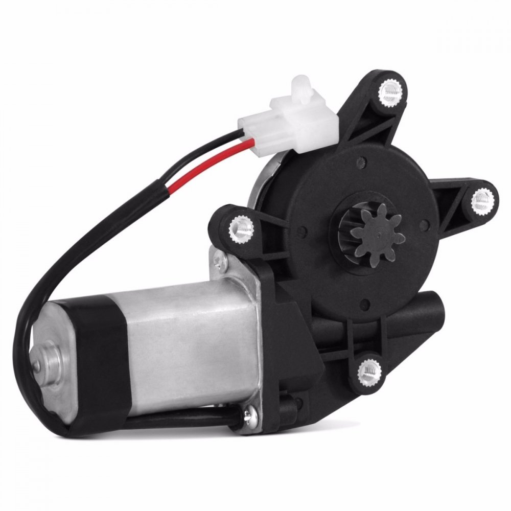

# Projeto Robo de Sumo Simples
### Nivel de Dificuldade: Easy
### Comunity: BigRobot
#### Projetista: Juan Manoel


##### Componentes do Robo
* 1x  Arduino 
* 2x  Motores dc 6v 
* 1x  ponte H 5v 
* 1x  Sensor Ultrasonico 
* 1x  Sensor de IR(detectar Linha)7
* 8x  Pilhas recarregavel

###### Objetivo do Robo
--- 
- Um ponto de partida para quem quer competir em categoria de robo de Sumo. 

###### Software Nescessarios 
- IDE ARDUINO Atualizada 

### Circuito do Robo


```python
from IPython.display import Image
Image("roboSumoSimples_bb.png")
```


### PS: vale ressaltar que para ligar o arduino você deve usar uma bateria tipo power bank


```python
from IPython.display import Image
Image("powerbank.jpeg", width=330, height=330)
```


### Codigo do Arduino 
#### Usando a biblioteca de Ultrasonic
#### os Pinos de trigger 4 e echo 5 para pinos do sensor ultrasom
#### Para detectar a linha do circulo o pino 6 para receber os dados de HIGH e LOW, se receber HIGH ele anda e ao mesmo tempo o sensor de distancia tiver em uma distancia de 15 cm ele anda pra frente caso contrario usa um for para find o adiversario

#### * void setup define os pinos dos motores 8,9,10,11
#### * void loop roda o loop citado a cima 
#### * void motor uma função para controle dos motores usando no void loop


```python
from os import popen
codigo = popen("cat RoboSumoSimples.ino").read()
print (codigo)
```

    #include <Ultrasonic.h>
    
    
    #define pino_trigger 4
    #define pino_echo 5
    
    
    Ultrasonic ultrasonic(pino_trigger, pino_echo);
    #define Sensor_linha 6
    bool linha;
    int pinMotors[] = {8, 9, 10, 11}; 
    
    void setup()
    {
      Serial.begin(9600);
      pinMode(Sensor_linha, INPUT);
      for (int i = 0; i < sizeof(pinMotors); i++) {
        pinMode(pinMotors[i], OUTPUT);
      }
    }
    
    void loop()
    {
    
      float cmMsec;
      long microsec = ultrasonic.timing();
      cmMsec = ultrasonic.convert(microsec, Ultrasonic::CM);
    
      Serial.print(cmMsec);
    
      linha = digitalRead(Sensor_linha);
       
      if ( linha == HIGH && cmMsec == 15.0){
          Motor(255,255);
          delay(1000);
      } else {
        for (int i = 10; i < 200; i++) {
          Motor(i,i+5);
          if (cmMsec == 15.0){
             Motor(255,255);
             delay(1000);
    				}
          }
      }
    
    }
    
    void Motor(int left, int right) {
      digitalWrite(pinMotors[0], left > 0 ? LOW : (left != 0 ? HIGH : LOW));
      analogWrite(pinMotors[1], left);
      digitalWrite(pinMotors[2], right > 0 ? LOW : (right != 0 ? HIGH : LOW));
      analogWrite(pinMotors[3], right);
    }
    
    


### Alternativa a Ponte H usando Modulo rele
#### Modulo rele de 4 canais
#### vermelhor = 12v
#### preto = GND/Terra


```python
from IPython.display import Image
Image("pontehrele.png", width=690, height=390)
```


### Alternativa para Motor 12v 
#### Motor tipo: motor mabuchi


```python
from IPython.display import Image
Image("motor.jpg", width=330, height=390)
```





### Alternativa de Montagem 
#### Essa é uma alternativa para robo de sumo


```python
Image("test-1.jpg", width=330, height=390)
```


```python
Image("test0.jpg", width=330, height=390)
```


```python
Image("test1.jpg", width=330, height=390)
```


```python
Image("test2.jpg", width=330, height=390)
```


```python
Image("test3.jpg", width=330, height=390)
```


### Fontes de pesquisa
Site: http://tecnomelque.blogspot.com/2010/12/robo-lutador-de-sumo.html

Site: http://tecnomelque.blogspot.com/2016/08/modulo-rele-de-4-canais-como-ponte-h.html

Artigo: https://revistas.unifacs.br/index.php/sepa/article/download/305/253

Artigo: http://www.inicepg.univap.br/cd/INIC_2016/anais/arquivos/1103_1180_01.pdf
